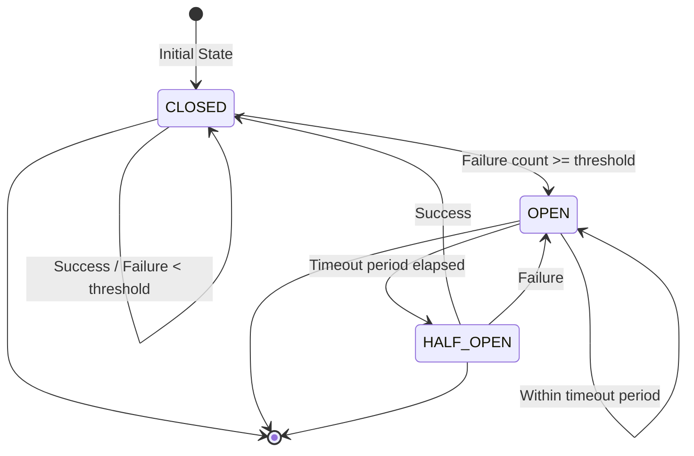

# Circuit Breaker Pattern: Comprehensive Guide

## Table of Contents
1. [What is a Circuit Breaker](#what-is-a-circuit-breaker)
2. [When to Use Circuit Breakers](#when-to-use-circuit-breakers)
3. [How Circuit Breakers Work](#how-circuit-breakers-work)
4. [The Three Circuit States](#the-three-circuit-states)
5. [Benefits and Trade-offs](#benefits-and-trade-offs)
6. [Real-World Usage Examples](#real-world-usage-examples)
7. [Implementation Details](#implementation-details)
8. [Testing Scenarios](#testing-scenarios)

## What is a Circuit Breaker

A Circuit Breaker is a design pattern used in software development to prevent a failure in one part of a system from cascading and causing failures throughout the entire system. It works similarly to an electrical circuit breaker that trips when there's an overload, protecting the electrical system from damage.

The primary purposes of the Circuit Breaker pattern are:
1. **Prevent cascading failures**: When a service is failing, prevent multiple requests from piling up and overwhelming the failing service.
2. **Fail fast**: Immediately return an error response instead of waiting for a timeout when a service is known to be failing.
3. **Enable recovery**: Allow the failing service time to recover by temporarily stopping requests to it.
4. **Provide monitoring**: Offer visibility into the health of dependencies.

The Circuit Breaker monitors calls to a specific service and, if too many calls fail, it "trips" and starts returning errors immediately without making the actual call. After a timeout, it allows a limited number of test calls to see if the service has recovered.

## When to Use Circuit Breakers

Circuit Breakers are most beneficial in the following scenarios:

1. **Remote service calls**: When your application makes requests to external services, APIs, or microservices that might be unreliable or slow.

2. **Database connections**: When connecting to databases that might experience high load or network issues.

3. **Third-party integrations**: When integrating with external services like payment gateways, email services, or social media APIs.

4. **Resource-intensive operations**: When performing operations that consume significant resources (e.g., file processing, image conversion) that might fail or timeout.

5. **Distributed systems**: In microservices architectures where one service's failure could impact multiple other services.

6. **High-traffic applications**: Applications that need to maintain performance under heavy load conditions.

7. **Network-dependent applications**: Applications that rely heavily on network connectivity that may be unreliable.

The Circuit Breaker pattern is particularly important when there's a risk of:
- Timeout exceptions
- Connection failures
- Resource exhaustion
- Cascading failures affecting multiple components

## How Circuit Breakers Work

My implementation of the Circuit Breaker follows the standard pattern with three distinct states:

### Configuration Parameters
- `threshold`: Number of consecutive failures before opening the circuit (default: 5)
- `timeout`: Time in milliseconds to wait in the OPEN state before allowing test calls (default: 60,000ms)
- `resetTimeout`: Time to wait in HALF_OPEN state before reverting to OPEN (default: 10,000ms)

### Core Logic
1. The `call()` method is the main entry point that wraps the operation you want to protect
2. Based on the current state, it either executes the operation directly, fails fast, or attempts a test call
3. After each call, it updates internal state based on success or failure
4. It tracks failure count and the time of the last failure

### State Transitions
- When in CLOSED state and a failure occurs, increment the failure counter
- When failure count reaches the threshold, transition to OPEN
- When in OPEN state and timeout period has passed, transition to HALF_OPEN
- When in HALF_OPEN state and call succeeds, transition to CLOSED
- When in HALF_OPEN state and call fails, transition back to OPEN

The implementation provides methods to check the current state and failure count, which helps with monitoring and debugging.

## The Three Circuit States

### CLOSED State
- The circuit breaker allows requests to pass through to the underlying service
- It monitors the number of failed calls
- If failures exceed the threshold, it transitions to the OPEN state
- This is the normal operating state when the service is healthy
- Successes reset the failure counter

### OPEN State
- The circuit breaker blocks all requests and returns an error immediately
- No calls are made to the underlying service, giving it time to recover
- After a predefined timeout period, it transitions to the HALF_OPEN state
- This state prevents cascading failures when the dependency is unavailable

### HALF_OPEN State
- The circuit breaker allows only one request to go through as a test
- If the test request succeeds, the circuit breaker transitions back to CLOSED
- If the test request fails, it reverts to OPEN
- This is a temporary state used to determine if the service has recovered
- Only one request is allowed in this state to prevent overwhelming a potentially recovering service

These states work together to provide resilience: CLOSED during normal operation, OPEN during failures to protect the system, and HALF_OPEN to cautiously test recovery.

### State Transition Diagram



The diagram illustrates the three states and the transitions between them:
- **CLOSED** → **OPEN**: When the failure threshold is reached
- **OPEN** → **HALF_OPEN**: After the timeout period has elapsed
- **HALF_OPEN** → **CLOSED**: When a test call succeeds
- **HALF_OPEN** → **OPEN**: When a test call fails

## Benefits and Trade-offs

### Benefits
1. **Improved system resilience**: Prevents cascading failures throughout a distributed system
2. **Better user experience**: Provides faster error responses instead of long timeouts
3. **Service protection**: Gives failing services time to recover without being overwhelmed
4. **System stability**: Maintains overall system stability even when individual components fail
5. **Monitoring capabilities**: Provides visibility into service health and failure patterns
6. **Automatic recovery**: Automatically tests for service recovery without manual intervention

### Trade-offs and Considerations
1. **Added complexity**: Increases system complexity with additional state management
2. **Potential false positives**: Might trip during temporary high load that the service could handle
3. **Configuration challenges**: Requires careful tuning of thresholds and timeouts
4. **Additional latency**: Small overhead for checking circuit state
5. **State consistency**: In distributed systems, maintaining circuit breaker state consistency can be challenging
6. **Debugging complexity**: Can make debugging more difficult as failures might be masked by the circuit breaker

### Configuration Considerations
- Set threshold appropriately: Too low may cause unnecessary trips; too high may not provide protection
- Timeout should be long enough for service recovery but not so long that users experience extended downtime
- Monitor circuit breaker metrics to adjust parameters based on real-world usage patterns

## Real-World Usage Examples

### E-commerce Platforms
- **Protecting payment services**: If the payment gateway is experiencing issues, the circuit breaker can temporarily stop processing orders until the service recovers, preventing financial transaction failures from affecting the entire platform
- **Product catalog API**: When the product catalog service is down, the circuit breaker can return cached data or gracefully degrade the user experience

### Microservices Architecture
- **User service dependency**: When the user profile service is unavailable, a circuit breaker can prevent the order processing service from failing, allowing orders to be processed with minimal user information
- **Recommendation engine**: If the recommendation service is slow or failing, the circuit breaker can allow users to continue shopping while temporarily disabling personalized recommendations

### API Gateway
- **External service integration**: When integrating with third-party services like social media APIs, weather services, or shipping calculators, circuit breakers protect your system when these external dependencies fail
- **Rate limiting protection**: Circuit breakers can be used in conjunction with rate limiting to prevent overwhelming downstream services

### Cloud Applications
- **Database connection failures**: Circuit breakers can protect against database connection pool exhaustion by failing fast when the database is unavailable
- **Message queue systems**: When message brokers like RabbitMQ or Kafka are unavailable, circuit breakers can help applications continue operating by queuing locally or switching to alternative communication methods

### Mobile Applications
- **Network connectivity**: When mobile apps experience poor network conditions, circuit breakers can switch to offline mode and queue operations for later processing
- **Backend API protection**: Mobile applications can implement circuit breakers to handle unreliable mobile networks gracefully

### Example Scenario Implementation
In the provided implementation, the `CircuitBreakerService` demonstrates how to wrap potentially unreliable operations:

```typescript
async httpClientCall(url: string): Promise<string> {
  return this.circuitBreaker.call(async () => {
    // Simulate HTTP request that might fail
    if (Math.random() < 0.4) {
      throw new Error(`HTTP request to ${url} failed`);
    }
    return `Success: HTTP response from ${url}`;
  });
}
```

This pattern would typically wrap actual HTTP client calls to external services, database queries, or other operations that might fail. The circuit breaker protects the application from being overwhelmed by failures while providing a path for the failing service to recover.

## Implementation Details

### Core Circuit Breaker Class (`circuit-breaker.ts`)
The main CircuitBreaker class manages the state transitions and call execution:

- **State Management**: Tracks the current state (CLOSED, OPEN, HALF_OPEN)
- **Failure Counting**: Keeps track of consecutive failures
- **Success Counting**: Tracks successes to reset failure count
- **Time Tracking**: Records when the last failure occurred to determine timeout periods
- **Call Execution**: Manages the execution of protected operations based on current state

### Service Integration (`circuit-breaker.service.ts`)
The service demonstrates practical usage of the circuit breaker:

- **Unreliable Service Calls**: Simulates operations that may fail
- **HTTP Client Simulation**: Demonstrates API call protection
- **State Reporting**: Provides access to current circuit breaker state

### REST API (`circuit-breaker.controller.ts`)
The controller exposes endpoints for testing and monitoring:

- **Service Call Endpoints**: Allow testing of protected operations
- **State Endpoint**: Provides real-time view of circuit breaker state
- **Reset Functionality**: Allows manual reset (in production scenarios)

### Example Usage (`example-usage.ts`)
Demonstrates the circuit breaker behavior:

- **State Transitions**: Shows how the circuit moves between states
- **Failure Scenarios**: Illustrates what happens under failure conditions
- **Recovery Testing**: Shows how the circuit tests for service recovery

## Testing Scenarios

### Unit Tests (`circuit-breaker.spec.ts`)
The tests verify the following behaviors:

1. **Initial State**: Circuit breaker starts in CLOSED state
2. **Success Handling**: Circuit remains CLOSED when calls succeed
3. **Failure Handling**: Circuit opens after reaching failure threshold
4. **Open State**: All calls fail immediately when OPEN
5. **Count Tracking**: Success and failure counts are maintained correctly

### Manual Testing
To manually test the circuit breaker:

1. Start the application with `npm run start`
2. Make multiple calls to the unreliable service endpoint
3. Observe the console logs as the circuit transitions between states
4. Check the state endpoint to verify the current state
5. Wait for the timeout period and observe the HALF_OPEN transition
6. Continue making calls to see if the circuit returns to CLOSED after successful operations

### Load Testing
To simulate real-world usage:

1. Use a tool like `curl` or Postman to make multiple concurrent requests
2. Create failure conditions to trigger the OPEN state
3. Monitor the circuit breaker's response to different failure patterns
4. Test recovery scenarios by introducing periods of success after failures

### Monitoring Scenarios
Monitor the circuit breaker in the following scenarios:

- High failure rates that should trigger OPEN state
- Recovery after extended downtime
- Intermittent failures that might cause state oscillation
- Normal operation with occasional failures
- Load spikes that might cause temporary failures

The circuit breaker implementation provides comprehensive protection against cascading failures while maintaining system stability and providing a path for service recovery.